<h1 align="center">
 
   
 
Clinic Health / Patient Manegment  APIrest
</h1>
<h3 align="center">CRUD APIrest micro service for a small clinic clients managment, with Flask and mongoDB</h3>

## UX
 
  The App was made to be used in a small Business where you can manage the clients data.
  It consists in 6 diferent routes:
  @app.route('/patients', methods=["POST"]): # This route is gonna create your patient and store in the dataBase, 
  it will return the mongo `_id` in the console if succesfully.
  
  @app.route('/patients', methods=['GET']): # This route has a fuction that allows you to list all patients
  in a JSON response in the server side with all params.
  
  @app.route('/patient/<id>', methods=["GET"]): # This route has a fuction that allows you to list a single patient by 
  the  `_id` in a JSON response in the server side with all params.
  
  @app.route('/patients/<id>', methods=['DELETE']): # This route has a fuction that allows you to delete a patient by 
  `_id` and returns a JSON in the console if succesfully.
  
  @app.route('/patients/<id>', methods=['PUT']): # This route has a fuction that allows you to update a patient by 
  `_id` and returns a JSON in the console if succesfully.
  
  @app.route('/'): # Test route returning a welcome H1 in the app depoyed on heroku "Doesn't fetch in the frontend"

  all the app has a clean writting making easy the reading and maintenance, Thinking about the user 
  experience The "Clinic or small Business" in case the app is growing improvements can be made in both client
  and server side ex: connect a mobile app to the API.
  
  ## Structure
    
    app.py - runs the backend
    .env.example - storage for your mongoDB key. (rename to ".env")
    Procfile - requirements for Heroku deployment
    requirements.txt - App's packages

 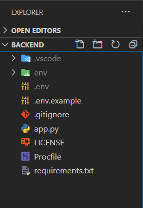 
    
    DB Model:

 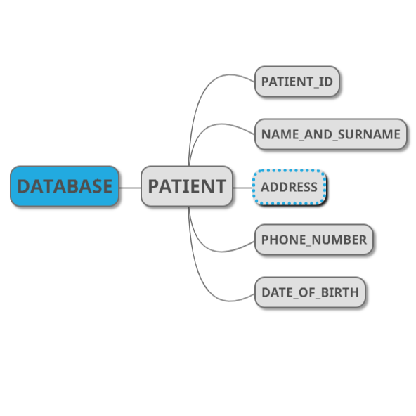 

## Features

    **Create and add Patient**
    **Find all Patients**
    **Find Patient by _ID**
    **Update Patient by _ID**
    **Delete Patient by _ID**

 ## Technologies 
 
- ☑️ **Flask** — Micro web framework written in Python.
- ☑️ **Venv** 
- ☑️ **Flask-PyMongo** 
- ☑️ **Flask-CORS** 
- ☑️ **Gunicorn** 
- ☑️ **python-dotenv** 

<h1 align="center">
 
    
Clinic Health / Patient Manegment  React App
</h1>
<h3 align="center">Frontend App That Fetchs the API</h3>

## UX
 
  The App consists in components:
  `PatientList` is a page where Users can add Patients filling their information in the form
  The page displays a table with all the patienmts and data, table that you can Update or delete patients.
  
  `Welcome` Welcome page displays two link buttons where yu can get started or go to the instructions Page.
  
  `Help` Help page displays 3 troggle links with the instructions how to use the app.
  
  `Navbar` Is a navbar component exported to be rendered in all pages.

  all the app is made thinking about the user experience, easy navigation, harmony colors and design,
  the app is following the best pratices in design software aiming, code maintenance, growth and better reading.
  Thinking in a possible growth improvements can be made Ex: Separete Table and Form in different pages
  but as the project is for as small Business/ Clinic it's fine for the purposes.
  the app has a simple design but is very effective, intuitive and easy to use.
  
  ## Structure
  
   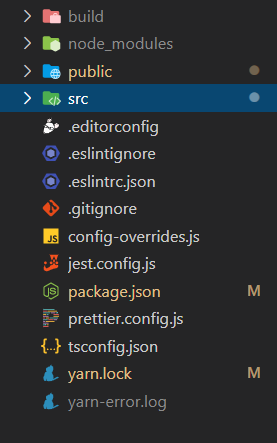   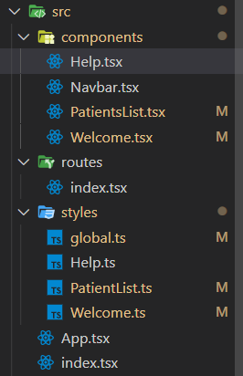 
    
    Relevant files in the root directory:
      build: static files for deployment
      package.json: All packages and libraries to be instaled.
    Under `frontend/src` you gonna find all the project's code source.
      Under `frontend/src/components` you gonna find all components to be rendered in the app.
      Under `frontend/src/styles` you gonna find all the CSS content for each component including a global style.
      Under `frontend/src/styles` you gonna find all routes to navigate in the app.
      
      Mockups on Figma:
      https://www.figma.com/file/Jozivw6lTlnyoGz698cZCl/Milestone-3?node-id=0%3A1
      
## Features

- PatientList page "/patient" You can create a Patient filling out the form
name, address, mobile and birthday.
  **Warning Validation**
  For flexibility purposes there is not max or min length in the inputs
  as Patients can have different names, addresses, and phone numbers from
  other countries. but you have to fill all of them in order to send as
  all of them are required in the client side.
- In the same page the patient table is displayed there you can find Patient's data
Edit and Delete button for each patient in the list.

- Welcome page "/" Page displays to differents buttons that each one redirect you
to the desidered route page.

- Help page "/" Page displays instructions how to use the app.

## Features Left to Implement
- In case of the app get bigger other features can be implemented:
Ex:
  Search Input get by user_name.
  Dedicated page for table and edit.

## Technologies 

- 📗 **ReactJs** — A JavaScript library for building user interfaces
- 📕 **styled-components** — Library transforms css in Components.
- 📙 **react-icons** — SVG React icons of popular icon packs using ES6 imports.
- 📒 **react-router-dom** — Library allows easy navigation in the app.
- 📘 **bootstrap** - Free and open-source CSS framework for responsive designs
- 🔡 **bootswatch** — Free Themes for bootstrap Framework. 
- ✅ **Lint** — ESlint/Prettier/Editor Config. 
- ☑️ **Typescrit** — TypeScript is a typed superset of JavaScript that compiles to plain JavaScript. 

## libraries
<pre>
* Typescrit:  it's a superset tool to type javascript typing your elements
in the app you can easy indentify the properties elements specially when the application is
getting big, it allows you to create interfaces to type your components with the params
that you want inside the components and much more... behind the scenes it compiles
your code in pure javascript wich will make sure it's gonna run in other browsers.
https://www.typescriptlang.org/

* Styled Components:  it's a CSS library that allow us to wrap all CSS styles in
a `var` that can be exported to our HTML pages as a react component. Syntax EX:

import styled from 'styled-components';                  import React from 'react';
                                                         
export const Container = styled.div`         **=>**      import { Container } from '../../_styles_css/explore/styles';
  p {                                                    
    font-weight: bold;                                   const HelloWorld: React.FC = () => {
    }                                                     return (
`;                                                          <Container>
                                                              **ReactJs**
                                                            </Container>
                                                           );
                                                         };
                                                         
                                                         export default HelloWorld;

For each element wrapped inside <Container> which is already an HTML tag in this case a `div` 
styled components already creates a unique class wich makes it way easy to work on, isolating 
the elements that you wanna apply styles.
https://styled-components.com/

## Responsive Layout
Reponsive layout using CSS grid from bootstrap.

As the app is used for internal purposes the design is "Desktop First"
but is fully responsive for mobile aswell the only difference is that
in small sizes address field in the tavble is gonna be hidden. 

App view:
   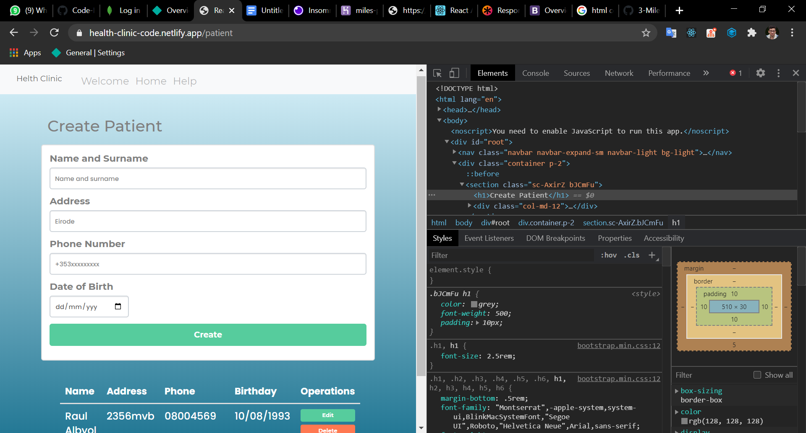 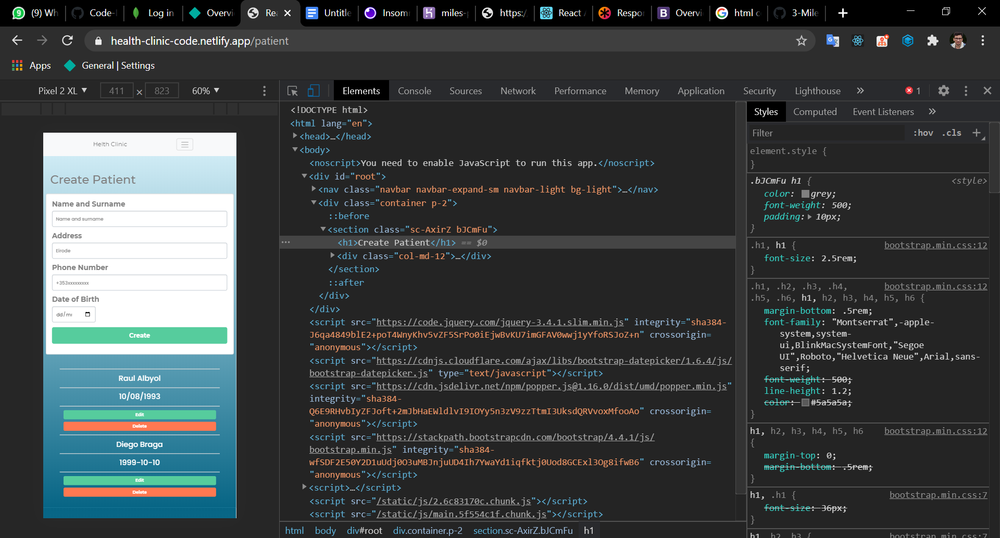 

## Testing
  ### Backend
  Manual tests using <a href="https://insomnia.rest/">Insomnia<a/> you can use <a href="https://www.postman.com/">Postman</a>
  if you prefer to check the requests and responses.
  API endpoints:
  
  Request Create / Store `https://miles-pro-3.herokuapp.com/patients`
  As you can see after the first post request it returns the _id in the console
  it means the Patient has been created.
  
   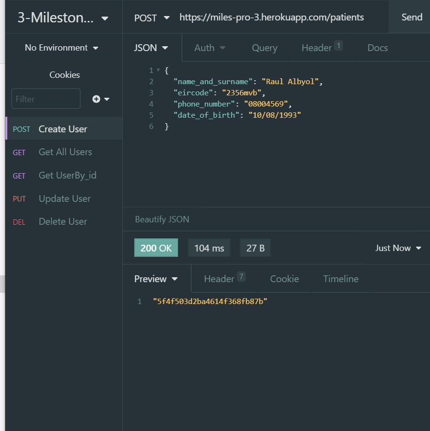 
  
  Request Find All `https://miles-pro-3.herokuapp.com/patients`
  The First picture represents the DB before the first Creation it returns none objects []
  The second picture represents after the first creation it returns an array with all Patients.
  
   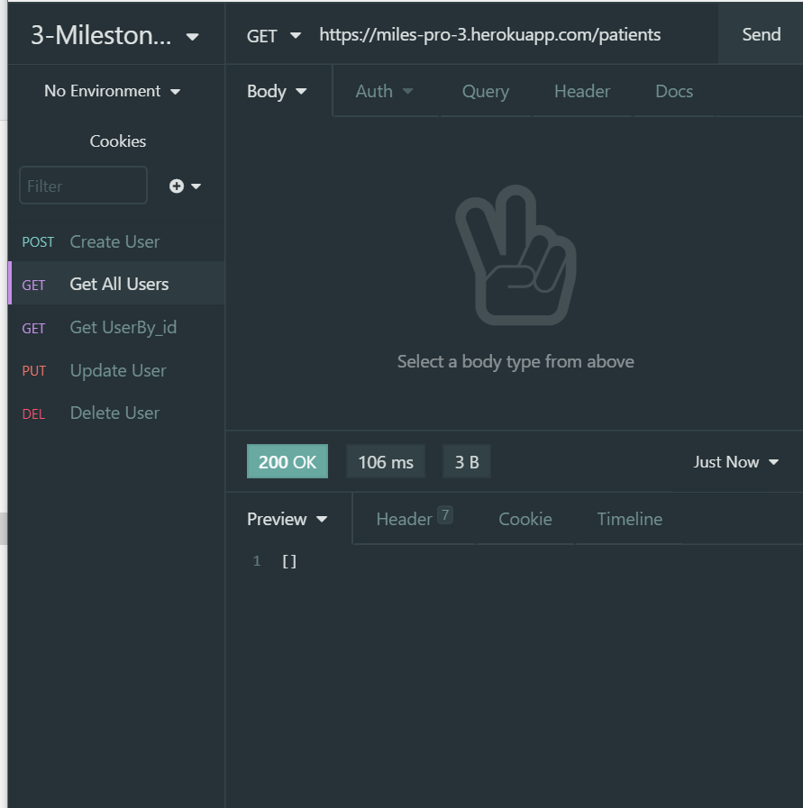  
  
  Request Find By id `https://miles-pro-3.herokuapp.com/patient/+${_id}`
  Pasting in the patient's params url the `_id` and seding GET returns specific 
  patien in the DB.
  
  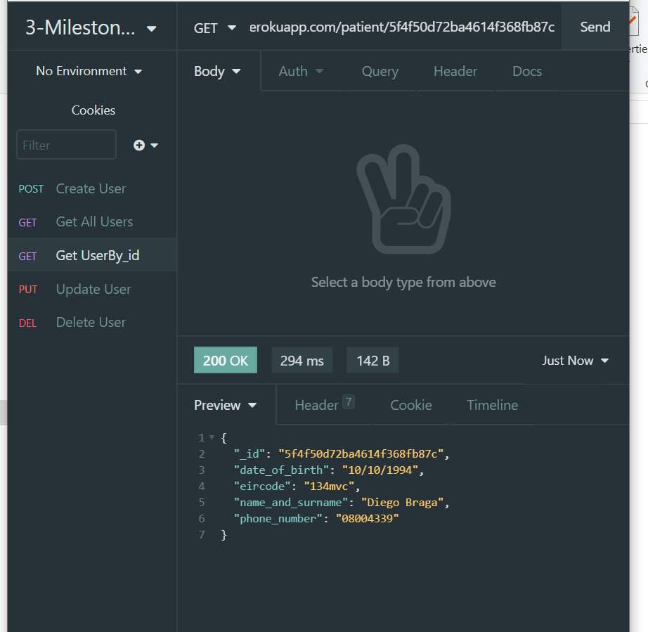

  Request Delete By id `https://miles-pro-3.herokuapp.com/patients/+${_id}`
  Pasting in the patient's params url the `_id` and sedind DELETE request returns a 
  message as you can see The patient has been deleted succesfully.
  "check on get request"

  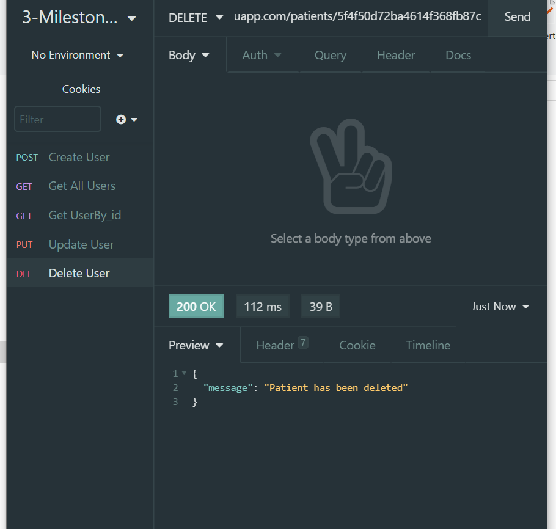

  Request Update By id `https://miles-pro-3.herokuapp.com/patients/+${_id}`
  Pasting in the patient's params url the `_id` and sedind PUT request after modify data
  returns a message as you can see The patient has been updated succesfully.
  "check on get request"

  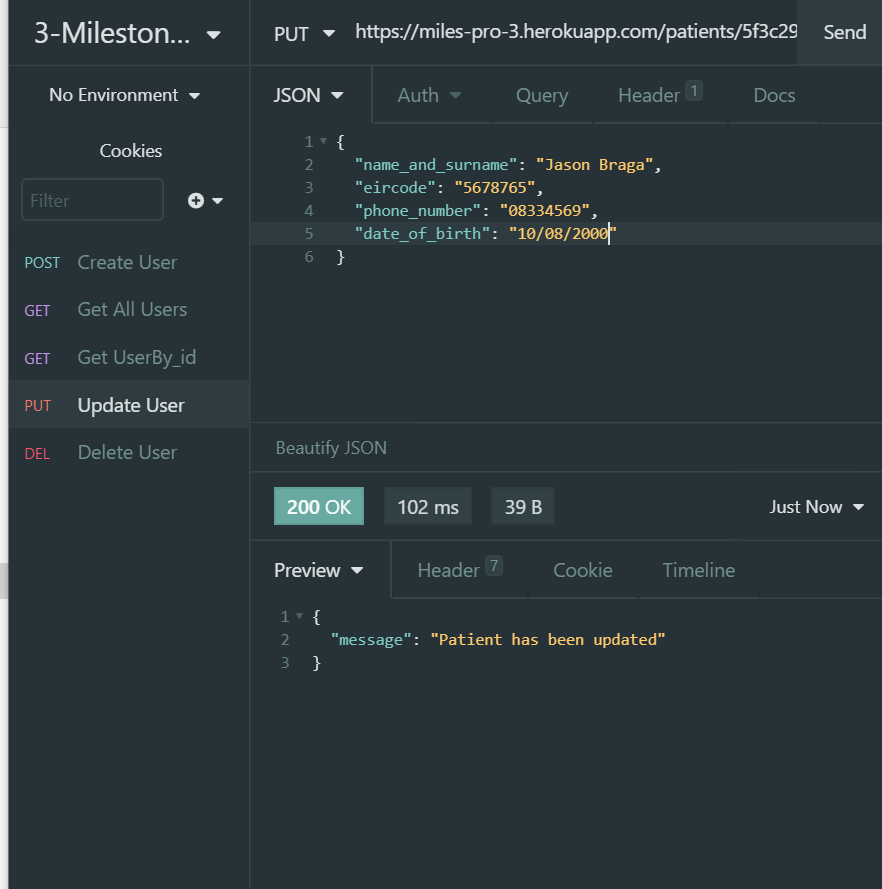
  
  ## Frontend
     <pre>
   Functionality Testing.
   Route Links in the app are tested you can free navigate in the application.
   
   The link in the app to an external page is working perfectly and target blank.
  
   Compatibility Testing.
   I tested the app manually on a variaty of browsers:
   
   Chrome
   Brave
   Edge
   
   and mobile:
   
   Iphone 10
   Sansung Galaxy S7
   
   Performance Testing.
   and different screen sizes using the inspector.
   criteria: responsivity, fluidity, design, sizes functionality behavior.   
   
Form:
JavaScript validation     
If validation ensure if the input value is not empty "Required".
Inputs Creation sending. returns the same data in the console listed in the
backend test section "_id".

Buttons update and delete 100% working returning in the console the same
messages listed in the backend test section.

Link buttons working directs user to the right place.
Link Troggle Buttons working and fluid.

Navbar Links working and responsive.

ESlint: Tool that verify automatcally your JS code, preventing,
fixing and reporting syntax errors, integrated with prettier
will ensure a beautifull and good style guid for better reading  
preventing errors.
To verify the rules and settings apllied in the project go on: 
frontend `route directory`
/eslintrc.json
/prettier.config.js

https://eslint.org/
https://prettier.io/
           </pre>

## Deployment 🚀🚀🚀

  ### Integrated Frontend
  On Netlify: https://health-clinic-code.netlify.app/
  
  ### Backend
  On Heroku: https://miles-pro-3.herokuapp.com/
  
  ### Local 
  Run In your Terminal in order to clone the repo to your local machine:
  $`git clone https://github.com/diebraga/3-Milestone-project/` 

  Flask App =>
  Requeriments:
  <a href="https://www.python.org/downloads/">Python 3 pip</a>
  
  Open your terminal run the command:
  $`virtualenv venv` - is gonna create you virtual env. 
  $`\env\Scripts\activate.bat` to activate it "windows".
  
  run:
  $`pip install -r requirements.txt` - to install the packages requirements.txt.
  
  In `.env.example` delete .example to `.env` only.
  inside your new .env file you find MONGO_URI='paste your mongo uri here (no brackets)'

  Now running your app.py
  the app will be open running at port `http://127.0.0.1:5000/`
  following the port if you see "Welcome to Diego's App" It's working!
  
  React App =>
  Requirements: 
  <a href="https://nodejs.org/en/">Nodejs NPM</a>
  Optional:
  <a href="https://yarnpkg.com/">Yarn</a>
  
  In frontend directory open your terminal and run:
  $`yarn` or `npm install` to install the dependencies, I'll be using yarn for this project.
  
  In frontend/src/components/PatientsList.tsx fetch your mongoDB URI:
  Ex: 
  fetch('https://your_mongo_uri/patients')
  There are 5 of those uris in the file. in my case I'm using: `https://localhost:5000`
  
  Now running in your terminal: 
  $`yarn start` you have your React app integrated to a micro service Flask API.
  
  **Warning**
  The App deployed online is slightly different from the one on github
  The one in my git repo is running on my localhost.
  The online one on my mongo remote URI.
  
  ### Acknowledgements

- I received inspiration for this project from:
  
  https://github.com/  
  https://codeinstitute.net/
  https://rocketseat.com.br/
  Book JavaScript Design Patterns. Addy Osmani.

  
## License

- Free Open Source.
  

  
  
  
  
  
  
  
  
  

